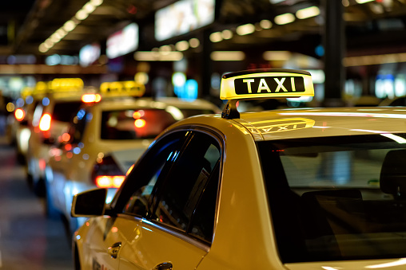
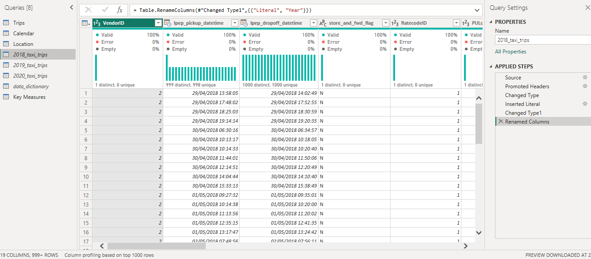
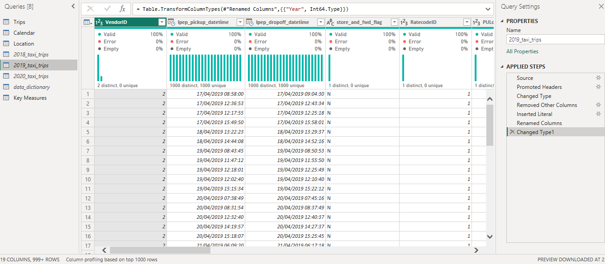
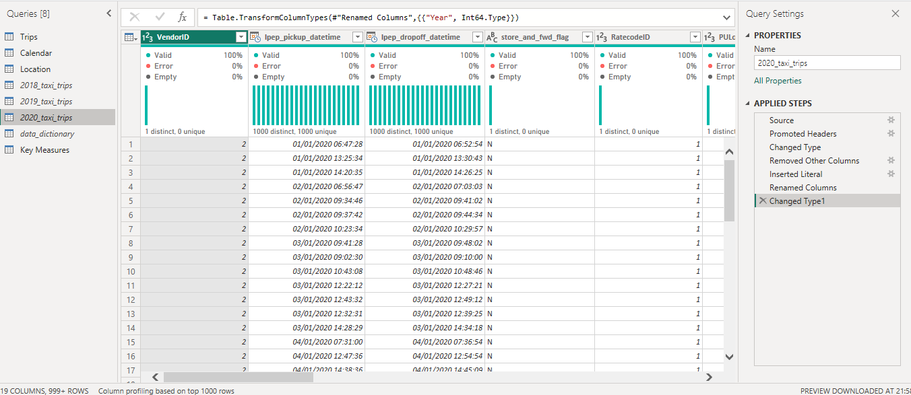
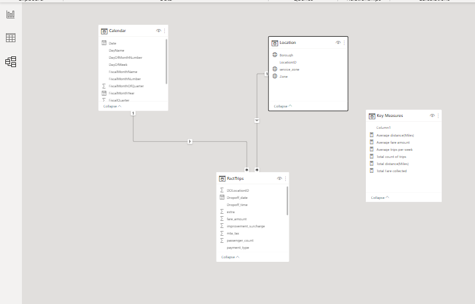
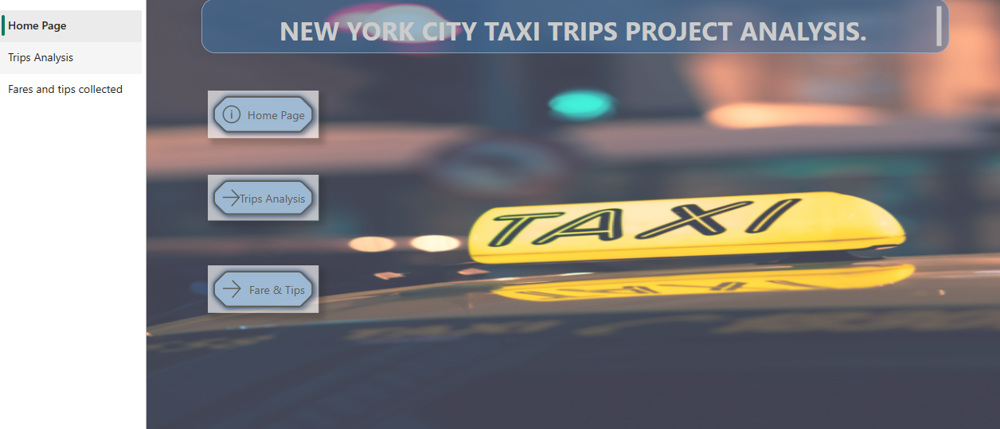
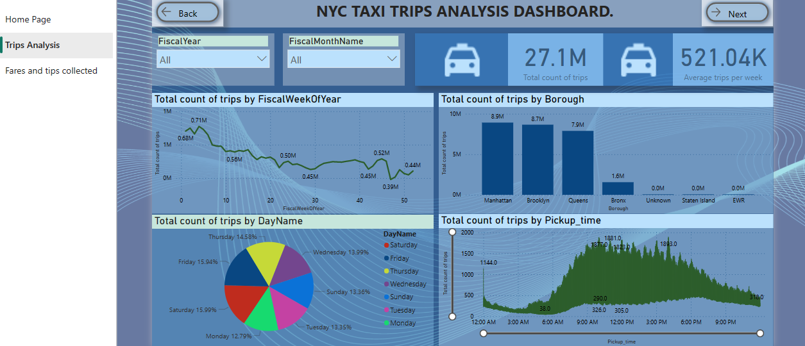
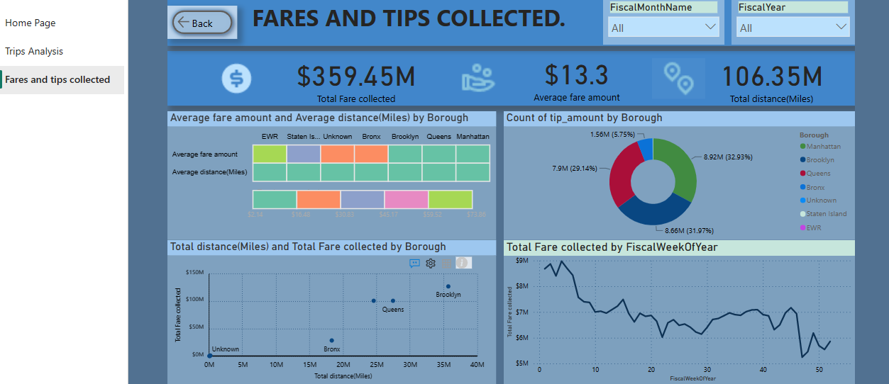
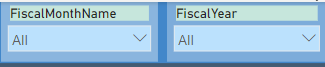
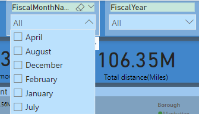

# New-York-City-Taxi-trips
This project is about  New York City Taxi trips from year 2017 -2020.

## Introduction
I am so excited that i got to work on this project, its a capstone project from Scenerio Academy and I love how much I had to transform the dataset to practice my skills of data cleaning, analysis and visualization.    
The project is to analyze the New York City taxi trips and derive insights to answer important questions.

## Power BI Concepts Applied:
- Data Modelling:The data model is a Star Scheme with 1 fact table and 2 dimension table. 
- DAX Concepts: Calculated measure.
- Page Navigation
- Filters
- Tooltips
- Button

## Problem Statement:
1. What is the total number of trips ?
2. What region has the highest number of trips?
3. what time of the day  and day in the week are the busiest? 
4. To ascertain the average amount of fare per trip.
5. To know the total fare collected  .
6. What is the total distance travelled across the three years?

## Data Sourcing:
The dataset consists of  6 csv files,i downloaded and extected it into power Query for cleaning and transformimg,then loaded into Power BI for analysis and visualization.
The Dataset contains 6 tables:
1. Calendar table  with 1,2456 rows.
2. Location table table with 265 rows.
3. 2017 table with millions of rows.
4. 2018 table with millions of rows.
5. 2019 table with millions of rows.
6. 2020 trip table with millions of rows. 

## Data Transformation/ Cleaning:
Data was cleaned and transformed with Power Query. After proper scrutiny,all the columns were clean and devoid of errors or empty spaces.
However,it was important that I derived my fact tables form 4 table ,some of the steps include:
1. Adding columns in the different year tables to insert literal year.
2. Appended Query by joining 2018 , 2019 and 2020 tables to 2017 table to make up the Trips Table,which is the Fact table.
3. Split datetime columnn by delimiter by making two seperate columns, e.t.c.

When the 2018,2019 and 2020 years table were appended to the 2017 year table, they  produced the FACT TABLE which is called TRIPS with 28,326,071 rows.
it is important to prevent the appended query from loading into Power BI, so 2018, 2019 and 2020 tables were not loaded into Power BI after being joined to the Fact Table.

2018  table                 |    2019    table            |     2020 table
--------------------------  | --------------------------- | ------------------------|
    |      | 

 ## Data Modelling:
The model is a Star Schema with 2 dimensions tables and 1 fact table. 
The dimension tables are all joined to the fact table with a one-to-many relationship. 

## Analysis and Visualization:
The report comprises 3 pages: 
1. Homepage
2. Trips analysis
3. Fares and tips. 

You can interact with the report [here](Link to Power BI service) (https://app.powerbi.com/groups/me/reports/0058f10f-3bd0-492b-bba1-64b083dcbd97/ReportSection97394769e1be62d6857e)

Features:
1.Imported background picture from the internet.
2. There are three buttons on the homepage, labeled: 
- Homepage
- Trips analysis 
- Fares and tips
They have hovering effects and each navigates the page with similar names.

 Trips analysis: 

From the above Visualisation, we can deduce the following insight:
1. The total count of trips is 27.1 million.
2. On average, there are 521.04 thousand trips per week .
3. The busiest day of the week is saturday with 15.99%, followed closely by friday with 15.94%.
4. Manhattan has the highest number of taxi trips in New York City,followed closely by Brooklyn.
5. Taxi trips are more by 4pm making it the busiest hour.
6. There are  11.4 million total trips in 2017.
7. There are 8.6 million in total trips 2018.
8. There are 5.8 million in total trips 2019. 
9. There are 1.3 million in total trips 2020.

Fares and tips: 

The Page displays an in-depth analysis about the amount of transport fare, tips collected and distance per miles travelled.
1. The total fare collected by taxis is $359.45 million .
2. The total distance trveled per miles in 2017 -2020 by taxis is 106.35 million miles.
3. On average, $13.3 is charged per taxi trip. 
4. Brooklyn has the highest total  fare collected with $127 million and highest distance travelled per miles with 127 million miles.
5. The people of Manhattan gave the highest tips to drivers. 
6. The total fare collected in 2017 is $ 134.99 million.
7. The total fare collected in 2018 is $117.24 million.
8. The total fare collected in 2019 is $ 85.05 million.
9. The total fare collected in 2020 is $22.17 million.

Filter Panes:

This report has two slicers/filter on each navigation page, the Monthname filter and Year filter. 
The Month name filter drills through the months of the year to give detailed information about each month of each year. While the year filter gives information about the each year.

Month and year filter   

Month filter drop down list

## Conclusions:
1. New York CIty has the highest number of taxi trips in 2017 compared to other years.
2. There was a great decline of taxi trips from 2018 and it got worse by 2020.
3. 2019 had the lowest amount of total taxi fare collected.
4. Manhattan has the highest number of trips, therefore more taxi cabs should be available for pick-up and drop-off.

## Thank you.  

